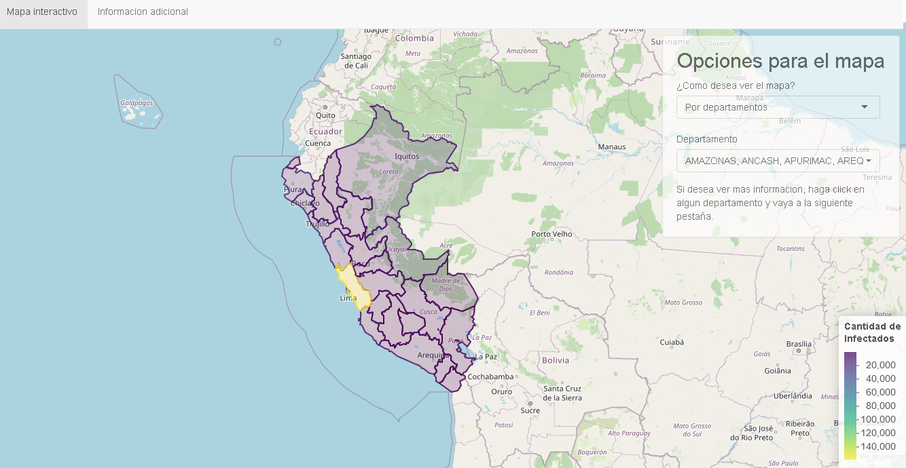
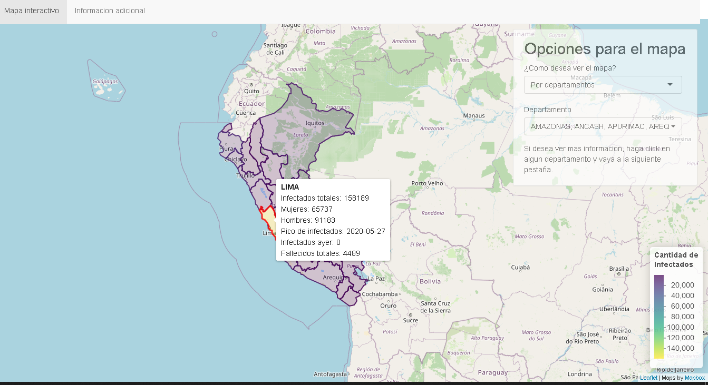
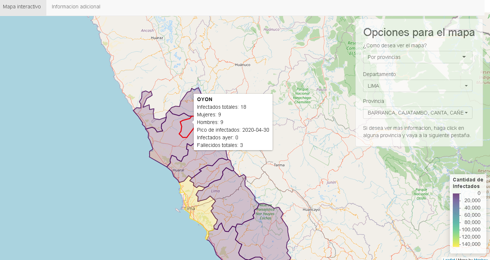
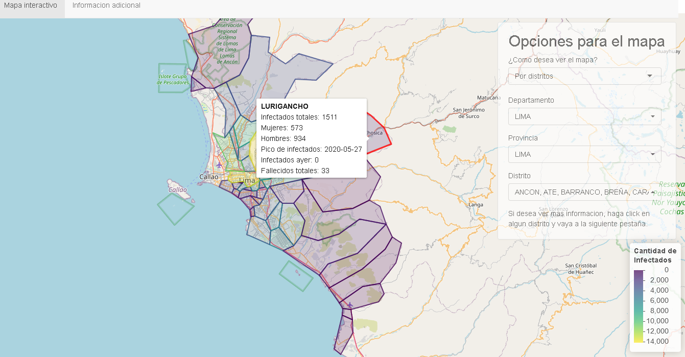
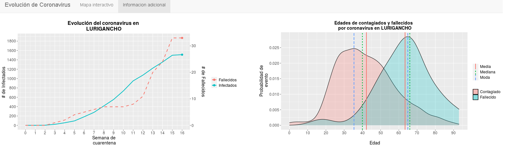
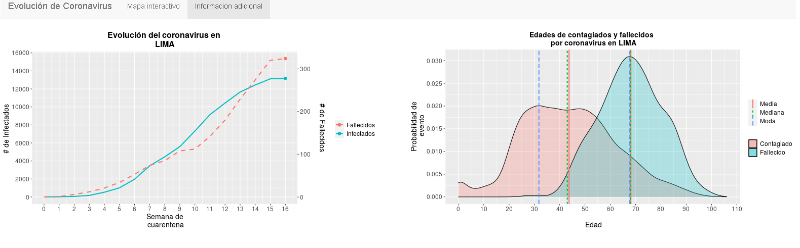

# Mapa de evolución del coronavirus en el Perú

> El proyecto presenta un dashboard que permite ver métricas de la evolución del coronavirus en nuestro país ( infectados, fallecidos, pico de infectados...)
> por departamento, provincias y distritos, cada uno por separado. Además nos permite observar como ha evolucionado la curva de infectados y fallecidos
> semana a semana desde la declaración de la cuarentena en nuestro país, así como la distribución de la edad de los mismos. 
> Toda la información recabada proviene de la [fuente de datos abiertas del gobierno del Perú](https://www.datosabiertos.gob.pe/). 
> Si deseas ver el mapa en tiempo real,  da click [aquí](https://lastete0109.shinyapps.io/covid-peru/?_ga=2.219214169.1973962094.1593619610-33371341.1591223441).

## Tabla de contenidos
* [Información general](#info-general)
* [Screenshots](#screenshots)

## Informacion general

El proyecto tiene como motivación principal brindar información que sea de ayuda o interés a cualquier público en general, ademas de ofrecer una guía para tomar acciones inteligentes de prevención y planificación. 
 Un caso práctico, por ejemplo, sería que en los ultimos días a la fecha de hoy (01/07/20), en nuestro país se habla de [cuarentenas focalizadas](https://gestion.pe/peru/cuarentena-focalizada-coronavirus-peru-manana-comienza-la-cuarentena-focalizada-asi-sera-la-nueva-convivencia-covid-19-nndc-noticia/) en función a los departamentos que han tenido mayor cantidad infectados en las ultimas semanas, dicha medida se puede aplicar a niveles sociales y geográficos más precisos con el uso de la presenta herramienta.

 ## Screenshots

 ### Departamentales
 
 

 ### Provinciales 
 

 ### Distritales
 
 
 ### Graficas
  
  
